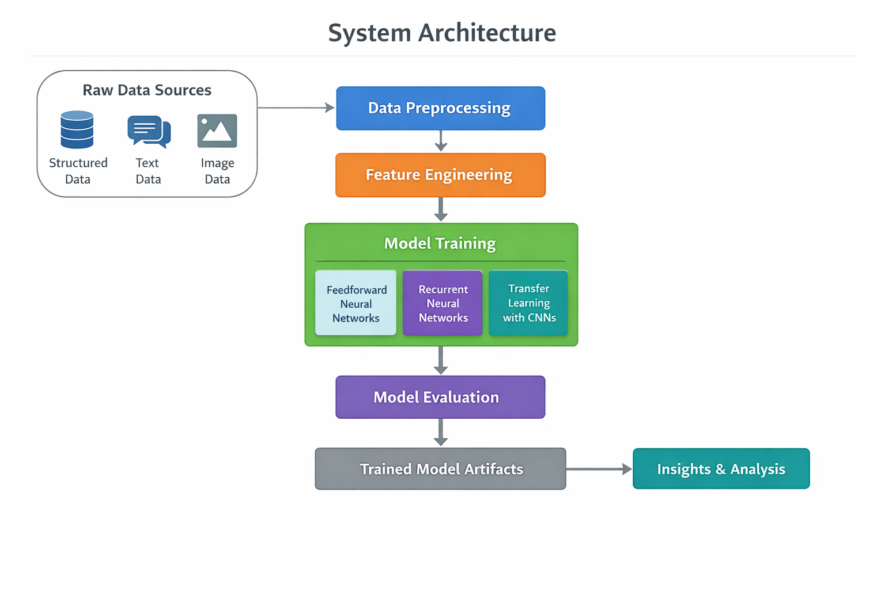

# Deep Learning Models in Practice

A curated collection of applied deep learning case studies demonstrating hands-on implementation of neural networks across structured data, text, and images.

Rather than focusing on a single use case, this repository showcases breadth, depth, and reasoning across multiple deep learning paradigms — from first-principles neural network mechanics to modern transfer learning.

---

## What This Repository Demonstrates

- Practical understanding of **neural network mechanics** (forward and backpropagation)
- Application of **feedforward networks** on structured and business-style datasets
- **Sequential modeling** using Recurrent Neural Networks (RNNs) for text data
- **Transfer learning** with pretrained Convolutional Neural Networks (CNNs) for image classification
- Model evaluation, comparison and decisio-oriented reasoning across different data modalities

---

## System Architecture

The following diagram illustrates the end-to-end system design shared across all projects in this repository.



### Architectural Flow
- **Raw Data Sources**: Structured tabular data, text data, and image data depending on the use case
- **Data Preprocessing**: Cleaning, normalization, tokenization, scaling, and encoding
- **Feature Engineering**: Transforming raw inputs into model-ready representations
- **Model Training**:
  - Feedforward Neural Networks for structured data
  - Recurrent Neural Networks (LSTM) for sequential text data
  - Transfer Learning with pretrained CNNs for image data
- **Model Evaluation**: Accuracy, precision, recall, F1-score, and convergence behavior
- **Artifacts & Insights**: Trained models, metrics, and analytical insights for decision-making

This architecture emphasizes **modularity, reproducibility, and comparative learning**, enabling consistent experimentation across different deep learning paradigms.

---

## Case Studies Included

### 1. Neural Network Fundamentals
> Building intuition behind how and why neural networks learn

A from-scratch implementation of a simple neural network to build intuition by focusing on:
- Xavier initialization
- Forward propagation
- Closed-form backpropagation gradients
- Gradient descent updates
- The impact of activation functions (Linear vs ReLU)
This focuses on how and why neural networks learn, rather than treating them as black boxes.

### 2. Customer Churn Prediction
> Business-aligned binary classification using feedforward neural networks.

An end-to-end churn prediction project using the Telco Customer Churn dataset, covering:
- Reproducible dataset ingestion directly from Kaggle
- Exploratory data analysis to identify churn drivers
- Feature preprocessing and scaling for neural networks
- Baseline vs improved PyTorch models
- Handling class imbalance using weighted loss functions
- Threshold tuning to prioritise business-critical recall
This highlights why accuracy alone is insufficient in real-world classification problems.

### 3. Spam Classification (RNNs)
> Sequential text classification using Recurrent Neural Networks.

A natural language processing task focusing on:
- Text preprocessing and tokenisation
- Sequence modeling with RNN architectures
- Learning temporal dependencies in text data
- Evaluating classification performance on imbalanced datasets

### 4. Image Classification (Transfer Learning)
> Efficient image classification using pretrained Convolutional Neural Networks (CNNs).

An applied computer vision project demonstrating:
- Transfer learning with pretrained convolutional networks
- Freezing vs fine-tuning strategies
- Handling class imbalance and overfitting
- Staged training and performance comparison
This emphasises on efficient feature reuse and practical training strategies.

---

## Evaluation Focus
- Across projects, evaluation emphasises:
- Classification accuracy (where appropriate)
- Precision, recall, and F1-score under class imbalance
- Loss convergence and training stability
- Impact of architectural and optimisation choices
- Trade-offs between predictive performance and business priorities
- Model suitability for different data modalities

---

## Tech Stack

- Python
- TensorFlow / Keras
- NumPy, Pandas
- Scikit-learn
- Matplotlib, Seaborn
- PyTor1ch

---

## How to Run

1. Clone the repository:

```bash
git clone https://github.com/Vridhi-Wadhawan/deep-learning-models-in-practice.git
cd deep-learning-models-in-practice
```
2. Create and activate a virtual environment (recommended):
```bash
python -m venv venv
source venv/bin/activate      # On Windows: venv\Scripts\activate
```
3. Install dependencies:
```bash
pip install -r requirements.txt
```
4. Launch Jupyter Notebook
5. Navigate to the relevant project folder and run the notebooks sequentially.

---

## Future Work

This repository is designed as a learning-first and portfolio-focused project. Potential extensions include:

- Hyperparameter tuning and architecture search for improved performance
- Experimenting with modern architectures (Transformers for text, EfficientNet for vision)
- Adding experiment tracking (TensorBoard / MLflow)
- Model deployment using lightweight APIs (FastAPI / Streamlit)
- Incorporating explainability techniques (SHAP, saliency maps)
- Cross-project comparison dashboards for model performance

These extensions are intentionally left out to keep the focus on core deep learning understanding and reasoning.

---

## Notes

- This repository is intended for portfolio demonstration of applied deep learning skills
- Models are trained in experimental settings and are not deployed to production
- Projects prioritise clarity, reasoning, and reproducibility over optimisation
- Notebooks are intentionally verbose to surface modeling decisions and insights
